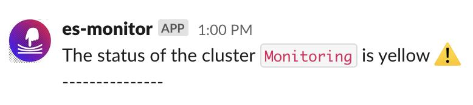

<h2> Monitoring Elasticsearch clusters and more</h2>
This is a simple poller that uses Elastic API. <br/>
It checks status of Elasticsearch cluster(s), notifies Slack if it is not green, and sends metrics to CloudWatch. <br/>

--- <br/> 


Default 4 clusters are defined: Monitoring, Development, Staging, Production <br/>
You can also modify clusters/names with cluster struct literals. <br/>
Define connection details with environment variables.


<h2> To run localy follow these steps: </h2>

- Clone this repo
- These envariable variables should be set:
  ```
  ES_PASSWORD_MON, ES_PASSWORD_DEV, ES_PASSWORD_STG, ES_PASSWORD_PROD
  ES_URL_MON, ES_URL_DEV, ES_URL_STG, ES_URL_PROD
  SLACK_TOKEN
  SLACK_CHANNEL
  AWS_REGION
  ```
- On Mac I recommend using keychain to store secrets locally e.g.:  
    `security add-generic-password -a "${USER}" -s "SLACK_TOKEN" -w` 

    Then add this to your ~/.zshrc or ~/.bashrc  
    `export SLACK_TOKEN=$(security find-generic-password -w -a "${USER}" -s "SLACK_TOKEN")`

- Build and run the app  
    `go build -o elastic-monitor && ./elastic-monitor`   

<h2> For testing: </h2>

```
 go test
Polling cluster state for Monitoring cluster
Cluster: Monitoring
Status: green
Publishing metric data points to Amazon CloudWatch...
Polling cluster state for Development cluster
Cluster: Development
Status: green
Publishing metric data points to Amazon CloudWatch...
Polling cluster state for Staging cluster
Cluster: Staging
Status: green
Publishing metric data points to Amazon CloudWatch...
Polling cluster state for Production cluster
Cluster: Production
Status: green
Publishing metric data points to Amazon CloudWatch...
Successfully checked status for Production cluster and sent metrics to Cloudwatch.
Successfully checked status for Staging cluster and sent metrics to Cloudwatch.
Successfully checked status for Development cluster and sent metrics to Cloudwatch.
Successfully checked status for Monitoring cluster and sent metrics to Cloudwatch.
PASS
ok      github.com/kiwibel/es-monitor   1.234s
```


